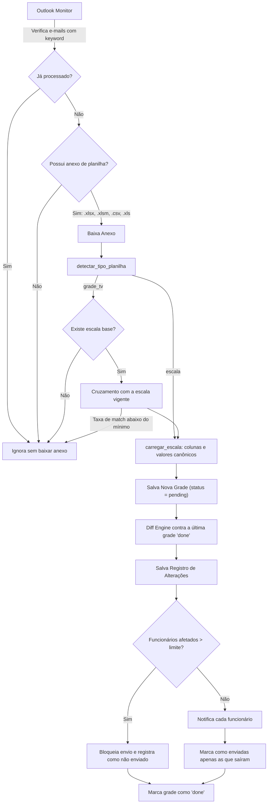

# Fluxo de Processamento de Escalas e Grade de TV

Documentação técnica referente ao ciclo de busca de e-mails, leitura de planilhas e motor de comparação (Diff).

---

## 🔁 Visão Geral do Fluxo



### Modo Teste

Com o Modo Teste ligado o ciclo **não grava nada no banco de produção** e não
envia e-mail. Cada arquivo processado gera uma pasta datada:

```
emails_teste/20260924_170125_GRADE_DE_SETEMBRO_-_27ª_VERSÃO/
    RESUMO.txt        base usada, contagens, avisos, funcionários afetados
    alteracoes.xlsx   todas as alterações + aba por funcionário
    emails/           um preview HTML por pessoa que seria notificada
```

A pasta raiz é configurável em `test_output_dir` (Configurações → *Pasta dos
relatórios de teste*); vazio usa `emails_teste/` ao lado do projeto.

Diferenças em relação ao ciclo real:

| | Modo Teste | Produção |
| :--- | :--- | :--- |
| Grade salva em `grade_items` | não | sim |
| Alterações em `changes` | não (vão para o .xlsx) | sim |
| Base de comparação avança | não | sim |
| `email_enviado` / dashboard | intocados | atualizados |
| Limite `max_funcionarios_por_ciclo` | só avisa no RESUMO | bloqueia o envio |
| E-mail marcado como processado | enquanto o Modo Teste estiver ligado | definitivo |

A última linha importa: ao desligar o Modo Teste, os e-mails homologados voltam
à fila e são processados de verdade.

### Invariantes do ciclo

| Invariante | Por quê |
| :--- | :--- |
| A grade só vira base de comparação depois de `status = 'done'` | Uma falha no meio do ciclo não pode virar baseline nem queimar o e-mail de origem |
| `is_email_processed()` só considera grades `'done'` | Falhou? o e-mail volta a ser elegível na próxima varredura |
| `email_enviado = 1` apenas por alteração efetivamente notificada | O histórico e o dashboard precisam refletir o que saiu de verdade |
| Só cancela evento em data que a grade realmente cobre | Grade especializada (Combate, PPV) não tem autoridade sobre o resto da programação |
| Datas e horários são gravados como `dd/mm/aaaa` e `HH:MM` | Garante que gravar e reler devolva o mesmo valor, senão o diff acusa tudo |

---

## 📎 Formatos de Planilha Suportados

| Extensão | Descrição | Leitor Utilizado |
| :--- | :--- | :--- |
| `.xlsx` | Planilha padrão do Excel | `openpyxl` / `pandas` |
| `.xlsm` | Planilha com macros ativadas | `openpyxl` / `pandas` |
| `.csv` | Arquivo separado por vírgulas | `pandas.read_csv` |
| `.xls` | Planilha legada do Excel | `pandas.read_excel` |

---

## 🎯 Match de Eventos (`core/match_eventos.py`)

A função `carregar_grade(caminho)` realiza a varredura dinâmica das abas da planilha procurando a linha de cabeçalho correta nas primeiras 20 linhas. Ela aceita abas como `GRADE GE TV 2026`, `GRADE GE TV 2026 1 POR DIA`, entre outras variações, extraindo datas, horários de início/fim e descrições dos eventos.
